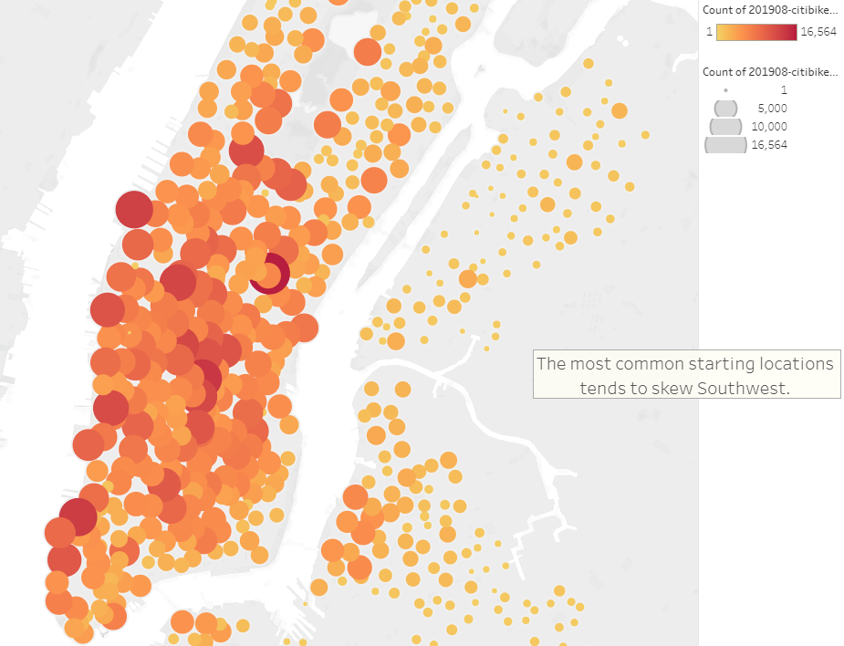
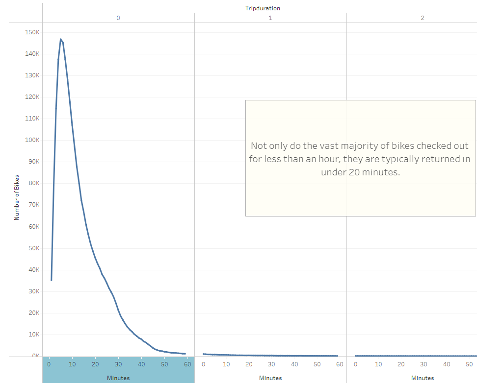
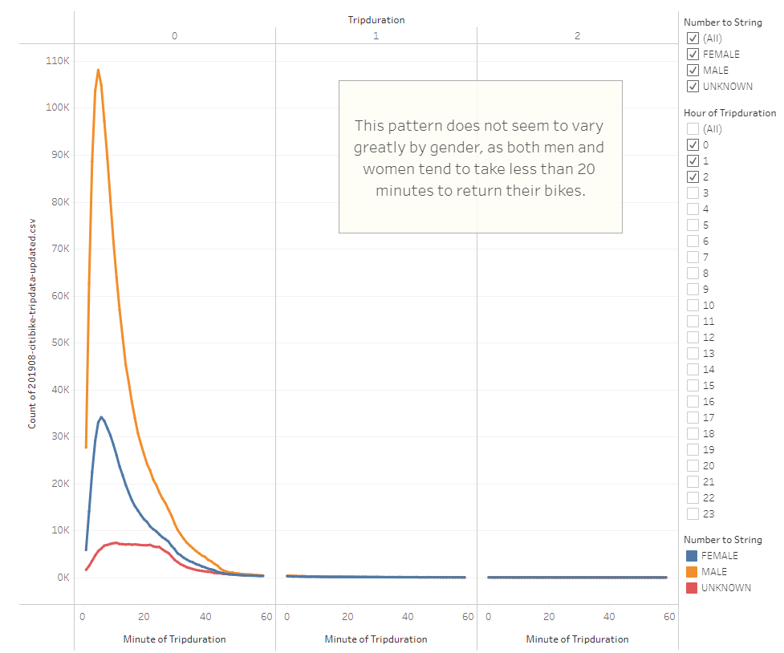
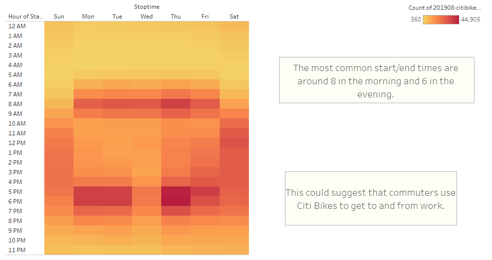
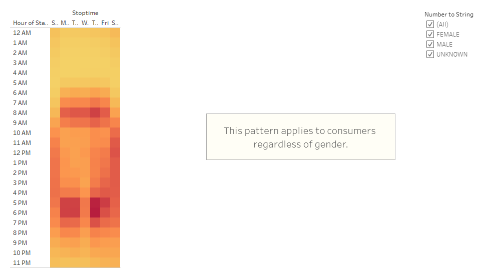
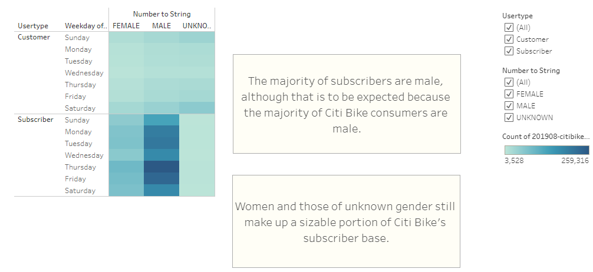

# bikesharing

## Overview

The purpose of this project is to visualize Citi Bike data in Tableau. Using these visualizations, key points about how people rent bikes in NYC and the breakdown of the consumer base is explored. 

## Results

 

The clear majority of Citi Bike's NYC consumer base are men. However, women and people of unknown gender still comprise a significant proportion of the overall consumer base. 

While Citi bikes are rented throughout New York City, the clear majority are rented out along the western coast.

The vast majority of trips taken using Citi Bikes in NYC last less than an hour, with the average time being about 10 to 15 minutes. 

This pattern holds true regardless of gender, with the average trip taking about 10-15 minutes. 

The most common start and stop times seem to be between 8 AM and 10 AM, as well as between 5 PM and 7 PM. This suggests that many Citi Bike consumers use the bikes to get to and from work. 

This pattern holds true for male, female, and unknown consumers. 

While most of Citi Bike's NYC subscribers are male, that is to be expected given that most of their consumer base is male. Therefore, one should not try to link gender to willingness to subscribe solely based on this data. 

## Summary

Overall, bike sharing programs are popular in densely populated, urban environments. Based on the data, bikes seem to be rented most in areas where traffic is densest and during times that people commute. Men seem to consume bike sharing services more, but that should not deter companies from marketing to all genders. In conclusion, bike sharing companies could theoretically thrive in any city where workers and tourists must navigate densely populated streets. 

If I were to take this data further, I would combine both the location and time based metrics to see at what times bikes tend to be rented in specific locations. This could be compared to tourist attractions and large workforce clusters to see what exactly is driving the demand. Additionally, I would try to obtain data on different times of the year to see if consumption is drastically impacted by the winter months. If so, cities with hotter climates than NYC may be prime locations for new bike sharing ventures. 

[link to dashboard](https://public.tableau.com/app/profile/erich.engelhardt/viz/NYCCitibike_16533443293810/CitiBikeData?publish=yes)
